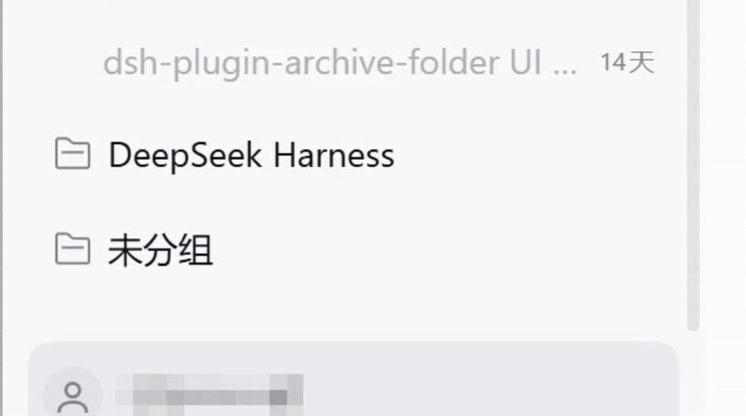
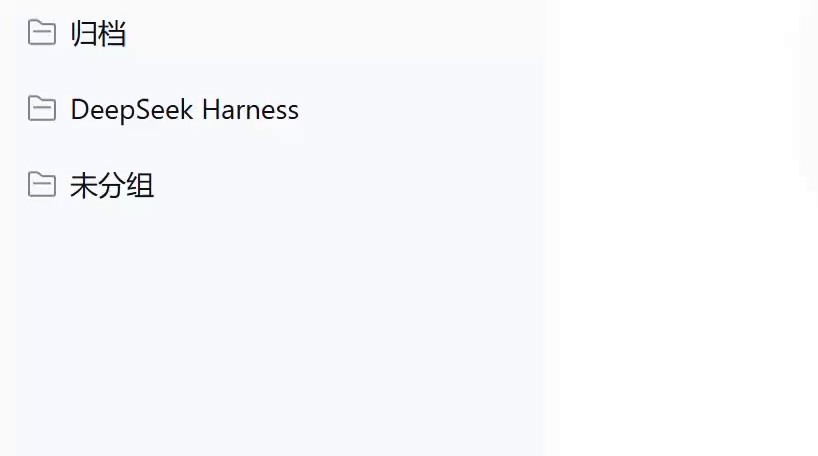

# dsh-plugin-delete-archived

**彻底删除 DeepSeek Harness 已归档会话与磁盘日志。**

DSH 自带的「归档」只是把会话从侧边栏收起来 —— 磁盘上的会话历史与日志依然完整保留。本插件补上最后一环：把已归档会话连同它的物理目录一起真正抹除，同时保留「恢复」这条退路。

[](LICENSE)

[English](README.md) | **简体中文**

---

## 功能

**设置 → 已归档会话**

列出全部已归档会话：标题、磁盘目录、占用空间、归档时间、所属工作区。支持逐条勾选与全选，批量 **恢复** 或 **彻底删除**。默认按归档时间由旧到新排列，所有删除入口都会先弹确认框。



**侧边栏会话菜单**

已归档会话的「⋯」菜单里会多出一项 **彻底删除会话**。



**Agent 工具**

`delete_archived_sessions`：传 `session_id` 删除指定会话；不传则删除全部已归档会话。未归档的会话永远不会被它碰到。

---

## 安装

在 DSH 的 **设置 → 插件 → 安装** 里粘贴：

```
github:Seelerc/dsh-plugin-delete-archived
```

也可以直接让 Agent 装 —— `plugin_manager`，`action: "install_bundle"`，`target: "github:Seelerc/dsh-plugin-delete-archived"`。

---

## HTTP API

插件在 DSH 的 Web 服务上注册的路由，供脚本与二次集成调用。

| 方法 | 路径 | 请求体 | 返回 |
| :--- | :--- | :--- | :--- |
| `GET` | `/api/archived-sessions` | — | `{ sessions: ArchivedSession[] }` |
| `POST` | `/api/archived-sessions/delete` | `{ sessionId }` | 单条删除结果 |
| `POST` | `/api/archived-sessions/delete-batch` | `{ sessionIds? }` | `{ total, deletedCount, errors }` |
| `POST` | `/api/archived-sessions/restore` | `{ sessionId }` | `{ success, sessionId }` |
| `POST` | `/api/archived-sessions/restore-batch` | `{ sessionIds }` | `{ success, restoredCount }` |
| `POST` | `/api/archived-sessions/open-folder` | `{ path }` | `{ success }` |

`delete-batch` 不传 `sessionIds` 时，等价于「删除全部已归档会话」。

```ts
interface ArchivedSession {
  id: string;
  title: string;
  cwd?: string;
  workspaceTitle: string;   // 未归属工作区时为「未分组」
  diskPath: string;         // 未定位到独立目录时为占位文案
  sizeBytes: number;
  sizeFormatted: string;    // 例如 "1.2 MB"
  createdAt: string | null; // ISO 8601
}
```

---

## 项目结构

```
dsh-plugin-delete-archived/
├── lib/
│   ├── index.js          # 后端：HTTP 路由、Agent 工具、磁盘清理逻辑
│   └── client.js         # 前端：设置页与侧边栏菜单注入（AMD loader）
├── locale/
│   ├── zh.json           # 中文文案
│   └── en.json           # 英文文案
├── cordis.patch.yml      # loader 注入声明
└── package.json          # 清单：exports / dsh.bundle / dsh.client
```

---

## 实现要点

- **物理目录定位**：优先通过 `sessionPersistence.findLog(sessionId)` 精确定位；失败则回退到扫描 `persistence.root` 下以编码后的 session id 命名的目录。
- **彻底删除**：抹除磁盘目录 → 从工作区解绑 → 从归档集合移除 → 清理 persistence 内部句柄与缓存。
- **前端注入**：客户端通过 `window.__ModuleLoader__.load()` 注册，向 `settings.section` 与 `sidebar.workspaces.session.menu.item` 两个 slot 注入组件。

---

## ⚠️ 注意

「彻底删除」不可撤销 —— 它会真正抹除磁盘上的会话历史与日志文件，**没有回收站，无法恢复**。插件所有删除入口都做了二次确认，但仍请确认目标会话确实不再需要。若只是想把它从侧边栏移走，用 DSH 原生的「归档」即可。

---

## 开发

纯 JS，无构建步骤。修改 `lib/client.js` 后，在 DSH 客户端插件 HMR 接收器处于活动状态时可直接生效；否则重启 DSH。

---

## 许可证

[MIT](LICENSE)
